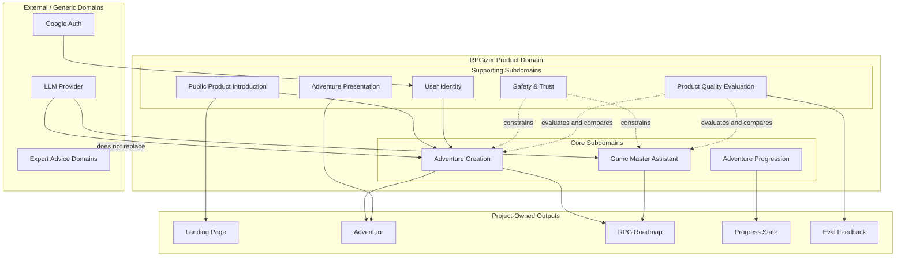
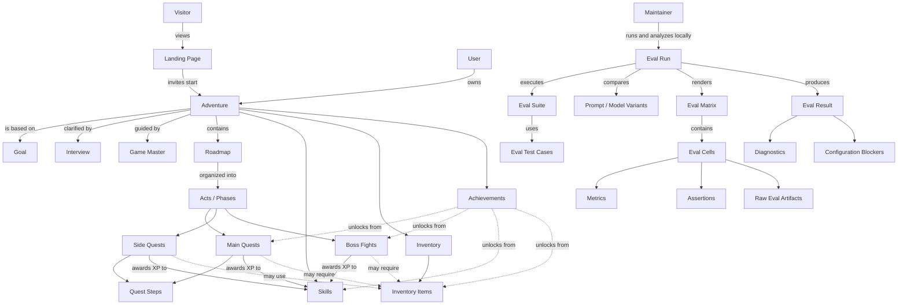

# Business Domain Model

## Document Control & Context

### Executive Summary / Purpose

RPGizer turns a real-life goal into a playable Adventure: a structured, RPG-style roadmap that helps the user take action one focused step at a time.

The business domain is not generic task management. It is the transformation of an unclear or overwhelming ambition into an Adventure with Acts, Main Quests, Side Quests, Boss Fights, Skills, Inventory, Achievements, and visible progression. The core value is momentum: helping the user complete real actions toward something they want to do.

### Domain Scope & Boundaries

In scope for the business model:

- Visitors who encounter RPGizer through the public product introduction before signing in or starting an Adventure.
- Google-authenticated Users who own Adventures.
- A Game Master that interviews users, generates Adventures, explains the roadmap, and helps revise it through user-triggered conversation.
- Adventures that move from interview to generated roadmap to active progress.
- Roadmaps made of Acts, Main Quests, Side Quests, Boss Fights, Skills, Inventory Items, and Achievements.
- Quest Steps that break Main Quests and Side Quests into concrete pending/done checklist items.
- Manual completion of Quests and Boss Fights.
- Manual acquisition of Inventory Items.
- Skill XP and leveling driven primarily by Quest and Boss completion.
- Achievements unlocked automatically from meaningful progress.
- Targeted roadmap updates through the Game Master.
- A public entry point that explains the RPGizer promise, shows the RPG-native value, and invites Visitors to start an Adventure.
- Local Product Quality Evaluation that helps maintainers run and analyze evals against Game Master behavior and Adventure generation quality before changes ship, including dense current-run inspection, test-case matrices, prompt/model variants, metrics, assertions, and local-only raw debugging details.

Out of scope for the initial domain model:

- A cross-adventure player character profile.
- A generic regenerate button for whole-roadmap replacement.
- Corporate project management, OKRs, team workflows, or task assignment.
- Expert medical, legal, financial, or safety advice.
- Hosted eval dashboards, persistent eval history, CI trend reporting, production monitoring, or user-facing quality scores.

## Ubiquitous Language

### Terms and Definitions

| Term | Definition |
| --- | --- |
| Visitor | A person evaluating RPGizer through the public landing experience before they become an authenticated User or start an Adventure. |
| User | A Google-authenticated person who owns and progresses through Adventures. |
| Goal | The real-life outcome the User wants to achieve. A Goal is the raw ambition before RPGizer turns it into an Adventure. |
| Adventure | The playable container for a Goal. It includes the interview context, generated roadmap, progression, edits, Skills, Inventory, Achievements, and current state. |
| Game Master | The AI assistant role and product guide. It interviews the User, decides when enough context exists, generates the Adventure, explains the roadmap, and helps revise specific parts when the User asks. |
| Interview | A one-question-at-a-time discovery flow led by the Game Master to understand enough context to generate a useful Adventure. |
| Readiness Threshold | The point where the Game Master has enough information to generate a specific, actionable Adventure. If the threshold is not met, the Interview continues. |
| Roadmap | The generated RPG-style plan inside an Adventure. It organizes real-world progress into Acts, Quests, Boss Fights, Skills, Inventory, and Achievements. |
| Act / Phase | A major chapter of the Adventure. Acts group related progress and often culminate in a Boss Fight. |
| Main Quest | A required milestone on the critical path to the Goal. |
| Side Quest | An optional but meaningful action that builds momentum, Skill, context, readiness, or delight. Side Quests should be interesting, not filler. |
| Boss Fight | A major challenge milestone that proves readiness to move into a new Act or complete a major part of the Adventure. Boss Fights are first-class RPG elements. |
| Quest | A general term for a Main Quest or Side Quest. Boss Fights are related progress units but have special milestone meaning. |
| Quest Step | A concrete checklist item inside a Main Quest or Side Quest that tells the User how to make progress on that Quest. Quest Steps can be pending or done, and completing all Quest Steps makes the Quest ready to complete without automatically completing it. |
| Skill | An Adventure-specific real-life capability the User is building. Quests and Boss Fights award XP to one or more Skills. |
| Skill XP | Progress points awarded to Skills, primarily when Quests or Boss Fights are completed. |
| Skill Level | A visible stage of growth in an Adventure-specific Skill. Leveling up should communicate real-world capability growth. |
| Inventory | The Adventure-specific collection of tools, resources, materials, documents, accounts, or supplies that help the User progress. |
| Inventory Item | A practical item the User may need or benefit from acquiring, such as a chef knife, cutting board, notebook, software account, gym shoes, or travel document. |
| Achievement | An automatically unlocked recognition of meaningful progress patterns, such as completing key quests, acquiring important inventory, defeating a Boss Fight, or leveling Skills. |
| Adventure Detail Page | The place where the User reviews, follows, edits, and discusses an Adventure after generation. |
| Roadmap Update | A targeted change to an Adventure made by the Game Master after the User asks for help adjusting a specific part. |
| Landing Page | The public entry point that introduces RPGizer, communicates the playable-goal promise, and invites a Visitor to start an Adventure. |
| Maintainer | A project team member who checks whether RPGizer's AI-assisted product behavior still meets quality expectations before changes ship. |
| Product Quality Evaluation | The local maintainer workflow for running and analyzing evals that check Game Master and Adventure generation behavior against product-quality expectations. |
| Eval Suite | A named group of eval checks for one product-quality area, such as Game Master interviews, Adventure content, dependency linking, XP balancing, or full Adventure generation. |
| Eval Test Case | A representative scenario used by an Eval Suite. It includes input variables, context, and assertions that define expected RPGizer behavior. |
| Eval Fixture | A synonym for Eval Test Case in older docs and implementation notes. New product language should prefer Eval Test Case when discussing the analysis UI. |
| Prompt / Model Variant | A named evaluation column that combines a prompt version, model choice, or equivalent AI behavior variant being compared in a local Eval Run. |
| Eval Matrix | A dense current-run analysis view where rows are Eval Test Cases, columns are Prompt / Model Variants, and cells show per-case output, metrics, and assertions. |
| Eval Cell | The result of one Eval Test Case executed against one Prompt / Model Variant. |
| Eval Metric | A per-cell or aggregate measurement such as latency, token count, and cost. Metrics may be exact, estimated, or unavailable depending on provider reporting. |
| Eval Assertion | A product-quality expectation checked against an Eval Cell, producing pass/fail feedback and failure details. |
| Eval Run | One maintainer-triggered execution of an Eval Suite against its Test Cases and selected Prompt / Model Variants. |
| Eval Result | The outcome of an Eval Run: passed, failed with diagnostics, or blocked by configuration. |
| Diagnostic | An explanation of a product-quality failure that helps the Maintainer understand what needs attention. Diagnostics may include local-only output snippets or assertion details, but must not expose secrets, credentials, API keys, session tokens, or unrelated sensitive data. |
| Raw Eval Artifact | Local-only debugging material for an Eval Cell, such as the full prompt, raw provider request/response payload, generated output, or comparison against an expected/golden output. |
| Configuration Blocker | A missing, placeholder, or invalid local setting, credential, or model configuration that prevents an Eval Run from executing meaningfully. |

### Synonym Clarification

- “Goal” is the desired real-world outcome; “Adventure” is the playable RPG-shaped version of that goal.
- “Roadmap” is the plan structure inside an Adventure, not a generic project plan.
- “Quest” may refer to Main Quests and Side Quests collectively. Boss Fights are special milestone challenges and should not be treated as ordinary tasks.
- “Quest Step” means a user-trackable checklist item within a Main Quest or Side Quest, not a separate Quest, subquest, or Boss Fight.
- “Inventory” means real-world readiness items, not random fantasy loot.
- “Game Master” is the AI assistant role, not a human coach or expert advisor.
- “Visitor” is a pre-auth/public-site role; “User” is an authenticated Adventure owner.
- “Product Quality Evaluation” is internal maintainer tooling, not user analytics, production monitoring, or a public quality score.
- “Eval Fixture” and “Eval Test Case” describe the same business idea for now; “Test Case” is preferred for matrix-style analysis because it maps directly to rows.
- “Eval Result” describes one local run outcome; it is not a production metric or user-visible quality score.
- “Raw Eval Artifact” is local maintainer debugging context, not hosted reporting data or persistent history in the current scope.

## Bounded Contexts & Subdomains

### Subdomains

Core subdomains:

- **Adventure Creation**: starting an Adventure, running the Interview, reaching readiness, and generating the Roadmap.
- **Adventure Progression**: completing Quest Steps, completing Quests and Boss Fights, acquiring Inventory Items, unlocking Achievements, and leveling Skills.
- **Game Master Assistant**: the AI assistant role across the Adventure lifecycle: interviewing, generating, explaining, and helping update the Roadmap through user-triggered conversation.

Supporting subdomains:

- **Public Product Introduction**: public-facing product explanation that helps Visitors understand the RPGizer promise and decide to start an Adventure.
- **User Identity**: Google-authenticated Users who own Adventures.
- **Adventure Presentation**: Adventure Detail Page concepts that make the generated roadmap reviewable and actionable.
- **Safety & Trust**: boundaries around high-stakes goals and AI-generated guidance.
- **Product Quality Evaluation**: local maintainer evaluation and analysis of Game Master and Adventure generation behavior against product-quality expectations.

Generic or external domains:

- Google authentication.
- LLM generation and conversation.
- External expert domains such as medicine, law, finance, travel regulations, or safety-critical instruction.

### Context Map

## Domain Concepts & Conceptual Diagram

### Conceptual Entities / Objects

- **Visitor** can encounter the Landing Page before becoming a User or starting an Adventure.
- **Landing Page** presents RPGizer's promise and directs a Visitor toward starting an Adventure.
- **User** owns zero or more Adventures.
- **Adventure** belongs to one User and represents one Goal.
- **Adventure** has one current lifecycle state.
- **Adventure** has one Roadmap after generation.
- **Roadmap** contains one or more Acts.
- **Act** contains Main Quests, Side Quests, and usually a Boss Fight.
- **Quest** belongs to an Act, contains Quest Steps, and can award XP to one or more Skills.
- **Quest Step** belongs to one Main Quest or Side Quest and gives the User one concrete pending/done action toward completing that Quest.
- **Boss Fight** belongs to an Act and awards meaningful XP and progress when completed.
- **Skill** belongs to one Adventure and gains XP from completed progress units.
- **Inventory Item** belongs to one Adventure and may be referenced by Quests or Boss Fights.
- **Achievement** belongs to one Adventure and unlocks automatically from progress patterns.
- **Game Master Conversation** belongs to one Adventure and can produce targeted Roadmap Updates.
- **Maintainer** can run and analyze Product Quality Evaluation locally before changes ship.
- **Product Quality Evaluation** organizes Eval Suites, Test Cases, Prompt / Model Variants, Eval Matrix views, Metrics, Assertions, Diagnostics, and local-only Raw Eval Artifacts that check product behavior rather than implementation correctness.
- **Eval Suite** contains one or more Eval Test Cases for a focused quality area.
- **Eval Test Case** contains input variables, scenario context, and assertions.
- **Prompt / Model Variant** defines one prompt version, model choice, or equivalent behavior variant to evaluate.
- **Eval Run** executes one Eval Suite against one or more Prompt / Model Variants and produces an Eval Result.
- **Eval Matrix** presents the current Eval Run with Test Cases as rows and Prompt / Model Variants as columns.
- **Eval Cell** contains the output, Metrics, Assertion outcomes, Diagnostics, and optional Raw Eval Artifacts for one Test Case / Variant pairing.
- **Diagnostic** explains why an Eval Run, Test Case, or Eval Cell failed in safe, actionable terms.
- **Configuration Blocker** prevents an Eval Run from executing when required local credentials or model settings are unavailable.

### Attributes / Characteristics

- Visitor: public-site role, interest in the RPGizer promise, intent to learn or start.
- Landing Page: public promise, RPG-native value explanation, examples, trust framing, and calls to start an Adventure.
- Adventure: title, Goal, current state, generated tone/theme, Acts, progress summary, Game Master context.
- Interview: ordered questions and answers, readiness status, missing context, safety concerns if any.
- Quest: title, description, type, Act, completion state, ready-to-complete state, concrete done condition, Quest Steps, linked Skills, optional Inventory references.
- Quest Step: concrete action wording, pending/done state, position within the Quest, and contribution to the Quest becoming ready to complete.
- Boss Fight: title, description, Act, completion state, challenge purpose, done condition, linked Skills and Inventory.
- Skill: name, real-world capability meaning, XP, level, progress explanation.
- Inventory Item: name, practical purpose, required/recommended status, acquired state, linked Quests or Boss Fights.
- Achievement: name, unlock condition, unlocked state, progress meaning.
- Maintainer: internal project role, local evaluation intent, product-quality judgment responsibility.
- Eval Suite: quality area, Test Case set, supported Prompt / Model Variants, expected product behavior, and safe/local artifact expectations.
- Eval Test Case: representative scenario, input variables, input context, assertions, expected or golden output when useful, and quality boundary being exercised.
- Prompt / Model Variant: variant name, prompt/model identity, comparison purpose, and local availability.
- Eval Run: selected suite, run status, Test Case outcomes, matrix cells, diagnostics, configuration blockers, metrics, and run-time feedback.
- Eval Cell: generated output, latency, token count, cost, assertion badges, failure details, and local-only raw artifacts where available.
- Eval Metric: latency, token count, and cost; may be exact, estimated, or unavailable.
- Diagnostic: affected Test Case, Eval Cell, assertion, or run area; safe message; quality concern category; and local-only detail where appropriate.

### Relationships & Cardinality

- One Visitor may become one User by authenticating or starting the Adventure flow.
- One Landing Page can introduce many Visitors to RPGizer.
- One User can have many Adventures.
- One Adventure has one Goal, but that Goal may be refined during the Interview or later Game Master conversation.
- One Adventure has many Acts once generated.
- One Act has many progress units and may culminate in one or more Boss Fights.
- One Main Quest or Side Quest can have many Quest Steps.
- One Quest Step belongs to one Main Quest or Side Quest.
- Boss Fights do not contain Quest Steps in the current domain model.
- One Quest can award XP to multiple Skills.
- One Skill can receive XP from many Quests and Boss Fights.
- One Inventory Item can support many Quests or Boss Fights.
- One Achievement can depend on multiple progress signals.
- One Maintainer can start many local Eval Runs.
- One Eval Suite can include many Eval Test Cases.
- One Eval Suite can define or support many Prompt / Model Variants.
- One Eval Run executes one Eval Suite at a time in the MVP, but may compare multiple Prompt / Model Variants inside that suite.
- One Eval Run can produce many Eval Cells: one for each evaluated Test Case / Prompt Model Variant pairing.
- One Eval Cell can include many Assertion outcomes and Metrics.
- One Eval Cell may expose Raw Eval Artifacts for local maintainer debugging only.
- One Eval Run can produce many Test Case-, Eval Cell-, assertion-, or run-level Diagnostics.
- One Configuration Blocker can stop an Eval Run before fixture execution.

## Domain Invariants & Business Rules

### Invariants

- The Landing Page must invite action without pretending that a Visitor has already created an Adventure.
- Public RPG flavor must make RPGizer feel exciting while keeping the product promise clear.
- Every Adventure must belong to a User.
- Every Adventure must be tied to a real-life Goal.
- The Game Master must ask one focused Interview question at a time.
- The Game Master must keep asking until the Adventure has enough context to be specific and actionable.
- Every generated RPG element must connect back to real-world progress.
- Every Quest and Boss Fight must have a concrete enough done condition that the User can tell when it is complete.
- Every Main Quest and Side Quest should include concrete Quest Steps when the User needs hand-holding to complete it.
- Quest Steps must describe real actions, decisions, checks, or artifacts that help the User complete the Quest.
- Completing all Quest Steps can make a Quest ready to complete, but it must not automatically complete the Quest.
- Main Quests must represent required critical-path progress.
- Side Quests must be optional but meaningful; they must not be filler.
- Boss Fights are first-class milestones, not optional flavor labels.
- Skills are specific to an Adventure in the MVP.
- Inventory Items must be practical readiness items, not meaningless loot.
- Achievements are unlocked automatically from meaningful progress.
- Quest Step completion is manually marked by the User.
- Quest and Boss completion are manually triggered by the User.
- Inventory acquisition is manually marked by the User.
- The main progress and XP loop centers on Quest and Boss completion.
- Roadmap Updates through the Game Master should be targeted by default and preserve the larger Adventure unless the User asks for a broader rethink.
- RPG flavor must not obscure actionability.
- RPGizer must not present high-stakes guidance as expert advice.
- Product Quality Evaluation must remain maintainer-facing and local-only in the MVP.
- Product Quality Evaluation must evaluate product behavior and output quality, not become a substitute for ordinary implementation tests.
- Product Quality Evaluation may expose raw prompts, raw provider requests/responses, generated outputs, and expected/golden comparisons only as local maintainer debugging artifacts.
- Raw Eval Artifacts must never expose secrets, credentials, API keys, session tokens, or unrelated sensitive data.
- Raw Eval Artifacts are current-run debugging context, not persistent history in the MVP.
- Eval Test Cases are the primary row concept for matrix analysis.
- Prompt / Model Variants are the primary column concept for matrix analysis.
- Eval Cells must make assertion pass/fail status visible for each Test Case / Variant pairing.
- Latency, token count, and cost are expected Eval Metrics when provider data is available; unavailable metrics must be shown as unavailable rather than treated as quality failures.
- Configuration Blockers must be reported as blockers, not as product-quality failures.

### Policies

- When a Visitor chooses to start an Adventure, the product should move them into the Adventure Creation flow.
- When the User starts an Adventure, the Game Master begins an Interview rather than generating immediately.
- When the Interview lacks enough context, the Game Master asks another focused question.
- When the readiness threshold is met, the Game Master generates the Adventure Roadmap.
- When a Quest Step is completed, the Adventure records step progress within its Quest.
- When all Quest Steps in a Quest are completed, the Quest should become ready to complete while still requiring manual Quest completion.
- When a Quest is completed, the Adventure updates progress and awards Skill XP.
- When a Boss Fight is completed, the Adventure records a major milestone and awards meaningful Skill XP.
- When Skill XP crosses a threshold, the Skill levels up.
- When an Achievement condition is met, the Achievement unlocks automatically.
- When an Inventory Item is acquired, the Adventure records readiness progress and may unlock an Achievement.
- When the User asks to change part of a Roadmap, the Game Master proposes or applies a targeted update.
- When the User’s goal touches expert or high-stakes domains, the Game Master should keep guidance structural, safe, and non-authoritative.
- When a Maintainer wants to check AI-assisted product behavior, they choose an Eval Suite and start a local Eval Run.
- When required local configuration is missing, placeholder, or invalid, the Eval Run should stop with a Configuration Blocker.
- When a Maintainer compares Prompt / Model Variants, the Eval Run should organize the comparison by Test Case and Variant so differences are easy to inspect.
- When Test Case assertions are not met, the Eval Run should fail with actionable Diagnostics and per-cell assertion failure details.
- When provider metric data is missing, the Eval Cell should show the metric as unavailable while preserving the rest of the result.
- When all Test Case expectations pass, the Eval Run should report success for the selected Eval Suite.

## Domain Events & Behaviors

### Key Lifecycle Triggers

Adventure states:

- **Drafting**: Interview is in progress and the Adventure is not ready to generate.
- **Generated**: Roadmap exists and the User can start.
- **In Progress**: The User has started completing Quests, Boss Fights, or acquiring Inventory.
- **Completed**: The Adventure’s Goal has been reached or the final Boss Fight is complete.
- **Archived**: The User no longer wants the Adventure active.

Product Quality Evaluation run outcomes:

- **Blocked by Configuration**: Required local credentials, model settings, or runtime configuration are missing, placeholder, or invalid.
- **Failed with Diagnostics**: The Eval Run executed but one or more Test Cases, Eval Cells, or Assertions did not meet product-quality expectations.
- **Passed**: The Eval Run executed and all Test Case expectations passed.

### Domain Events

- Visitor Invited to Start Adventure
- User Authenticated
- Adventure Started
- Interview Question Asked
- Interview Answered
- Adventure Ready to Generate
- Adventure Generated
- Quest Step Completed
- Quest Ready to Complete
- Quest Completed
- Boss Fight Completed
- Inventory Item Acquired
- Skill XP Awarded
- Skill Leveled Up
- Achievement Unlocked
- Roadmap Update Requested
- Roadmap Updated by Game Master
- Adventure Completed
- Adventure Archived
- Eval Suite Selected
- Eval Run Started
- Eval Run Blocked by Configuration
- Eval Test Case Evaluated
- Eval Cell Completed
- Eval Assertion Failed
- Eval Diagnostic Reported
- Eval Run Passed
- Eval Run Failed

The most important momentum event is **Quest Completed**. **Quest Step Completed** is a smaller momentum signal that shows the User is moving through a guided path toward real action.

## Out of Scope & Future Evolution

### Assumptions

- MVP includes a public landing entry point before authentication or Adventure ownership.
- MVP uses Google auth.
- MVP Adventures are mostly self-contained.
- A cross-adventure character/player profile is future evolution.
- Whole-roadmap regeneration is not an MVP concept; roadmap changes happen through user-triggered Game Master conversation.
- Skill XP values and leveling can be generated and adjusted by the system, but the User-facing meaning matters more than perfect numerical balance.
- Inventory contributes to readiness and may unlock Achievements, but should not replace Quest and Boss completion as the main progress loop.
- Quest Steps support Main Quest and Side Quest completion, but do not replace manual Quest completion as the main progression commitment.
- Product Quality Evaluation is local-only maintainer tooling for now.
- Eval Runs are viewed in the moment in the MVP; persistent run history is future evolution.
- Prompt / Model comparison is part of local Product Quality Evaluation, but it remains a maintainer debugging workflow rather than a public benchmark.
- Raw Eval Artifacts may be inspected locally during a run, but are not persisted beyond the current local workflow unless a future feature explicitly adds export or history.

### Known Variations / Debt

- Goal categories may eventually need specialized patterns, especially for travel, learning, health, career, creative projects, and product building.
- Boss Fight design may need careful tuning so milestones feel challenging without becoming intimidating.
- Side Quest quality is a hard product problem: they must feel optional, interesting, and useful, not like leftovers from the main plan.
- The Game Master role may later need a stronger character identity, name, or lore.
- High-stakes goals will require clear safety policies and disclaimers.
- Inventory could evolve into richer readiness tracking, shopping/checklists, or integrations, but should remain grounded in real-world usefulness.
- Quest Steps may later evolve into richer templates, generated worksheets, linked artifacts, or goal-specific guided tools, but the current domain model treats them as quest-agnostic checklist guidance.
- Product Quality Evaluation may later evolve into persisted history, trend reports, CI integration, richer Test Case management, artifact export, or LLM-as-judge workflows, but those are outside the local MVP.
